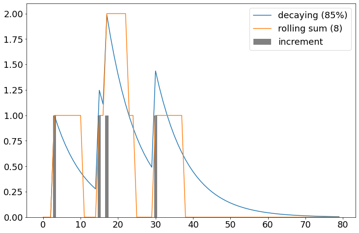

# Decaying counter

The value of this counter decays over time if you don't increment it.



## How to use it

```python
import numpy as np
import pandas as pd
from matplotlib import pyplot as plt
plt.rcParams['figure.figsize'] = [12,8]
plt.rcParams.update({'font.size':18})

class AnnealingCounter():

    def __init__(self, alpha=0.9):
        self.alpha = alpha  # rate of decay
        self.last_t = .0  # time of last increment
        self.value = .0  # value of counter at last_t
        
    def increment(self, x, t=None):
        """
        t is a floating point temporal index.
        If t is not provided, the value of last_t is used
        """
        if t is None: t = self.last_t
        elapsed = t - self.last_t
        if elapsed < .0 :
            raise ValueError('Cannot increment the counter in the past, i.e. before the last increment')
        self.value = x + self.value * (self.alpha ** elapsed)
        self.last_t = t

    def get_value(self, t=None):
        """
        t is a floating point temporal index.
        If t is not provided, the value of last_t is used
        """
        if t is None: t = self.last_t
        elapsed = t - self.last_t
        if elapsed < .0 :
            raise ValueError('Cannot increment the counter in the past, i.e. before the last increment')
        return self.value * (self.alpha ** elapsed)

    def __str__(self):
        return str('Counter value at time {}: {}'.format(self.last_t, self.value))

    def __repr__(self):
        return self.__str__()
        

c = AnnealingCounter(alpha=0.89)
decay = []
real = []
N = 80
for t in range(N):
    x = np.random.rand() < 0.05
    c.increment(x, t)
    value = c.get_value(t=t)
    decay.append(value)
    real.append(x)
sum_8_hrs = pd.Series(real).rolling(8,min_periods=1).sum().fillna(0)
plt.bar(range(N), real, color='gray', label='booked ffe')
plt.plot(decay, label='85% decay')
plt.plot(sum_8_hrs, label='8-hour. sum')
plt.legend()
plt.show()
```

